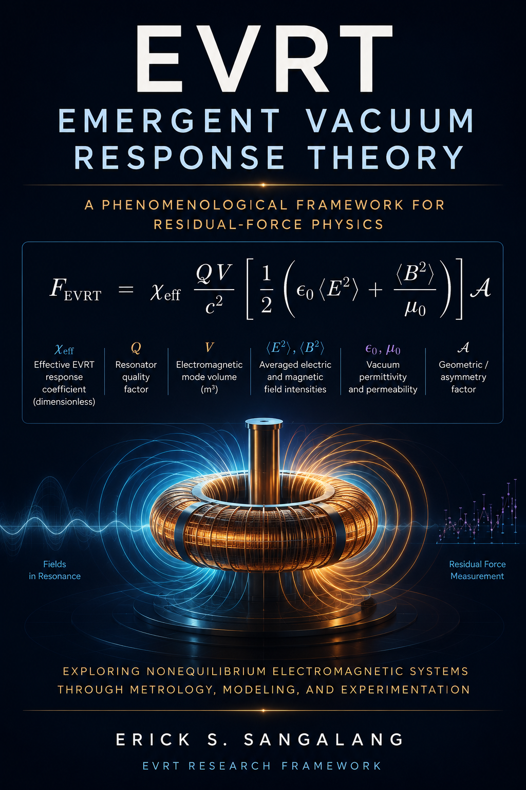

<br>

# EVRT — Emergent Vacuum Response Theory

## EVRT Research Framework v3.1

### Repository Architecture, Diagnostics, and Metrology Update

A constrained phenomenological research framework investigating whether structured nonequilibrium electromagnetic systems may exhibit measurable residual stress-energy effects under precision experimental conditions.

<p align="center">


</p>

---

## 🔬 Overview

This repository contains the consolidated EVRT (Emergent Vacuum Response Theory) research program — an interdisciplinary investigation into asymmetric electromagnetic field systems, resonant cavities, nonequilibrium electrodynamics, and precision residual-force metrology.

The project integrates:

- theoretical modeling
- constraint analysis
- numerical simulations
- experimental protocols
- artifact discrimination methodologies
- uncertainty analysis frameworks
- scaling-law architectures
- reproducible metrology workflows

The EVRT framework is designed to remain:

- falsifiable
- conservation-law constrained
- experimentally testable
- uncertainty-aware
- compatible with rigorous null-result interpretation

This repository does **not claim discovery of new physics** or verified propulsion phenomena.

Instead, it provides a structured scientific framework for investigating whether small residual effects may emerge in highly controlled nonequilibrium electromagnetic systems.

---

## 📚 Core Documentation

- [EVRT Series Overview](docs/evrt_series_overview.md)
- [Paper Index](papers/index.md)
- [Glossary](docs/glossary.md)
- [Repository Architecture](docs/repository_architecture.md)
- [Methodology](docs/methodology.md)
- [Roadmap](ROADMAP.md)
- [Version](VERSION.md)

---

## 📄 Core Framework Paper

### Emergent Vacuum Response in Nonequilibrium Electromagnetic Systems

#### A Constrained Phenomenological Framework with Experimental Pathways

> A constrained, falsifiable framework for testing potential emergent electromagnetic effects.

📥 [Download PDF](https://zenodo.org/records/19981661/files/EMERGE~1.PDF?download=1)

🔗 DOI: https://doi.org/10.5281/zenodo.19981660

This framework consolidates the broader EVRT research program into a unified phenomenological architecture emphasizing:

- falsifiability
- conservation-law consistency
- residual-force metrology
- precision experimental workflows
- simulation-guided parameter analysis

---

## 🚀 Flagship Framework Release

### Toward a Canonical Residual–Force Scaling Law for Coherent Nonequilibrium Electromagnetic Systems

🔗 DOI: https://doi.org/10.5281/zenodo.20072222

📥 [Download PDF](https://zenodo.org/records/20072222/files/TOWARD~1.PDF?download=1)

This release represents a major structural and documentation-focused evolution of the EVRT research repository.

The repository now functions as a structured open scientific framework integrating:

- phenomenological modeling
- simulation-guided analysis
- precision residual-force metrology
- uncertainty-aware diagnostics
- artifact-discrimination workflows
- canonical scaling architectures
- reproducible experimental methodology
- parameter-space visualization
- structured documentation systems

Major additions include:

- repository architecture redesign
- glossary and framework-overview documentation
- diagnostics infrastructure
- uncertainty-analysis visualization assets
- canonical scaling diagnostics
- expanded README ecosystem
- paper taxonomy organization
- reproducibility-oriented folder structures
- updated citation metadata

---

## 🧪 Experimental Reproducibility Packages

The EVRT framework now includes modular experimental packages intended to support reproducible, null-test-first metrology workflows.

| Package | Focus | Status |
|---|---|---|
| EVRT Precision Residual-Force Null-Test Package v1.0 | Torsion-balance residual-force diagnostics, calibration workflows, artifact controls, and uncertainty-aware null testing | Active |

These packages support:

- apparatus documentation
- calibration procedures
- control-test workflows
- uncertainty-budget analysis
- sample output datasets
- residual classification templates
- conservative null-result reporting

---

## 📄 Phase II — Experimental Diagnostics & Validation

### Artifact Discrimination and Residual-Force Metrology in Pais-Type Nonequilibrium Electromagnetic Architectures

🔗 DOI: https://doi.org/10.5281/zenodo.20055348

📥 [Download PDF](https://zenodo.org/records/20055349/files/ARTIFA~1.PDF?download=1)

This work focuses on artifact-aware residual-force diagnostics, uncertainty-aware metrology, and structured falsification methodology applied to Pais-type nonequilibrium electromagnetic architectures.

Major emphasis areas include:

- residual-force classification
- systematic artifact rejection
- precision metrology workflows
- uncertainty-aware interpretation
- experimental diagnostics

---

### Systematic Artifact Analysis and Null Hypothesis Stress Testing for Emergent Vacuum Response Experiments

> A falsification-focused analysis of experimental artifacts and control methodologies in EVRT testing.

📥 [Download PDF](https://zenodo.org/records/19983227/files/SYSTEM~1.PDF?download=1)

🔗 DOI: https://doi.org/10.5281/zenodo.19983226

This work extends the EVRT framework by systematically identifying and eliminating false-positive mechanisms in experimental investigations.

It provides:

- thermal, mechanical, electromagnetic, and EHD artifact analysis
- explicit signal-discrimination criteria
- structured null-hypothesis stress-testing methodology
- reproducibility-focused control strategies

---

## 🧩 Current Framework Status

The EVRT repository has evolved into a structured open research framework integrating:

- constrained phenomenological modeling
- simulation-guided parameter analysis
- precision residual-force metrology
- uncertainty-aware diagnostics
- artifact-discrimination workflows
- canonical scaling architectures
- reproducible experimental methodology
- modular experimental packages

Current emphasis areas include:

- falsifiable testing
- parameter-bound refinement
- uncertainty reduction
- scaling-law validation
- conservative interpretation
- reproducibility-oriented workflows

---

## 🧭 Repository Architecture


| Folder | Purpose |
|---|---|
| `papers/` | EVRT paper series organized by research layer |
| `figures/` | Diagnostics, scaling plots, workflows, and roadmap visuals |
| `experimental_packages/` | Reproducibility-oriented experimental packages |
| `analysis/` | Residual-force inference and uncertainty analysis |
| `data/` | Sample outputs, templates, and datasets |
| `docs/` | Glossary, methodology, and framework-overview documents |
| `simulations/` | Numerical modeling and exploratory simulations |
| `workflow/` | Process architecture and research workflow documentation |

---

## 🧠 Repository Philosophy

The EVRT repository is intended to function as:

- an open scientific framework
- a structured metrology architecture
- a simulation-guided analysis environment
- a reproducible experimental reference
- a documentation and visualization platform

The framework emphasizes:

- falsifiability
- uncertainty-aware interpretation
- systematic artifact rejection
- conservation-law consistency
- precision metrology
- reproducibility
- conservative interpretation of residual signatures

---

## 📚 Research Evolution

| Phase | Focus |
|---|---|
| Foundational Theory | Emergent vacuum susceptibility and nonequilibrium electrodynamics |
| Constraint & Validation | Conservation-law consistency, thermodynamic limits, and parameter bounds |
| Simulation & Modeling | Resonant cavity modeling and stress asymmetry analysis |
| Experimental Metrology | Precision residual-force testing architectures and controls |
| Canonical Scaling Framework | Residual-force scaling laws and diagnostic classification |
| Experimental Packages | Reproducibility-oriented null-test frameworks and operational workflows |

---

## ⚠️ Scientific Position

This work does **not claim discovery of new physics**.

Specifically, the framework does not claim:

- antigravity
- reactionless propulsion
- experimentally verified anomalous-force phenomena
- vacuum-energy extraction
- violation of conservation laws

Instead, the program:

- proposes falsifiable hypotheses
- enforces conservation-law consistency
- defines experimentally testable predictions
- treats null results as scientifically meaningful constraints
- emphasizes precision measurement and artifact rejection

---

## 📚 Selected Papers

### Foundational Theory

- The Entropic Vacuum — DOI: 10.5281/zenodo.19797710
- Emergent Nonequilibrium Vacuum Response Theory — DOI: 10.5281/zenodo.19836665
- Emergent Vacuum Response Theory (EVRT): Constraints, Numerical Simulations, and Experimental Pathways for Nonequilibrium Electrodynamics — DOI: 10.5281/zenodo.19891259

### Constraint & Validation

- Constraint Analysis and Parameter Bounds on Emergent Vacuum Response Models — DOI: 10.5281/zenodo.19866283
- Systematic Artifact Analysis and Null Hypothesis Stress Testing for Emergent Vacuum Response Experiments — DOI: 10.5281/zenodo.19983226
- Thermodynamic Constraints and Energy Budget Framework for Nonequilibrium Electromagnetic Systems — DOI: 10.5281/zenodo.20008382

### Simulation & Modeling

- Simulation-Guided Investigation of Emergent Vacuum Response in Resonant Electromagnetic Systems — DOI: 10.5281/zenodo.19835426
- Finite-Element Analysis of Resonant Electromagnetic Stress Redistribution in Asymmetric Cavities — DOI: 10.5281/zenodo.19867999
- Cross-Validated Numerical Predictions of Electromagnetic Stress Asymmetry in Asymmetric Resonant Cavities — DOI: 10.5281/zenodo.19951346

### Experimental Metrology

- Precision Experimental Protocols for Testing Resonant Electromagnetic Stress Redistribution Under Nonequilibrium Conditions — DOI: 10.5281/zenodo.19868582
- Minimal-Cost Experimental Test of EVRT Signatures in a Tabletop Resonator — DOI: 10.5281/zenodo.19926975
- Precision Experimental Protocol for Testing Residual Force Signatures in Asymmetric Nonequilibrium Electromagnetic Systems — DOI: 10.5281/zenodo.19984727

### Canonical Scaling Framework

- Toward a Canonical Residual–Force Scaling Law for Coherent Nonequilibrium Electromagnetic Systems — DOI: 10.5281/zenodo.20072222

---

## 📊 Diagnostic & Scaling Infrastructure

The EVRT framework includes structured diagnostic and scaling-analysis infrastructure supporting:

- artifact probability classification
- noise-floor comparison analysis
- uncertainty-budget visualization
- residual-force scaling laws
- signal-to-noise parameter studies
- effective susceptibility constraint mapping

Representative diagnostics include:

- `artifact_probability_heatmap.png`
- `noise_floor_comparison.png`
- `uncertainty_budget_chart.png`
- `signal_to_noise_vs_q.png`
- `chi_eff_bounds_map.png`

These assets support uncertainty-aware residual-force interpretation and reproducible metrology workflows.

---

## 📡 Current Experimental Status

At present, no experimentally verified residual-force effect has been established within the EVRT framework.

Current investigations are focused on:

- sensitivity-limited metrology
- artifact discrimination
- uncertainty reduction
- scaling-law validation
- reproducibility architectures
- parameter-bound refinement

Null results remain scientifically meaningful because they constrain possible EVRT-like response amplitudes and guide future experimental design.

---

## 🧪 Reproducibility

Simulations, analysis tools, and experimental packages are provided to explore parameter bounds, qualitative behavior, and controlled null-test workflows.

Results are intended for exploratory and phenomenological analysis rather than experimentally calibrated predictive validation.

Example usage:

```bash
pip install -r requirements.txt
python simulations/toy_model.py
